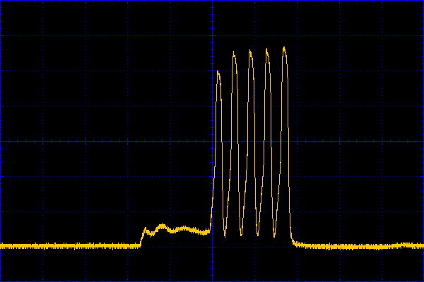

# A low power usayncio adaptation

Release 0.1 25th July 2018

 1. [Introduction](./README.md#1-introduction)  
 2. [Installation](./README.md#2-installation)  
  2.1 [Files](./README.md#21-files)  
 3. [Low power uasyncio operation](./README.md#3-low-power-uasyncio-operation)  
  3.1 [The official uasyncio package](./README.md#31-the-official-uasyncio-package)  
  3.2 [The low power adaptation](./README.md#32-the-low-power-adaptation)  
   3.2.1 [Consequences of pyb.stop](./README.md#321-consequences-of-pyb.stop)  
    3.2.1.1 [Timing Accuracy and rollover](./README.md#3211-timing-accuracy-and-rollover)  
    3.2.1.2 [USB](./README.md#3212-usb)  
   3.2.2 [Measured results](./README.md#322-measured-results)  
   3.2.3 [Current waveforms](./README.md#323-current-waveforms)  
 4. [The rtc_time module](./README.md#4-the-rtc_time-module)  
 5. [Application design](./README.md#5-application-design)  
  5.1 [Hardware](./README.md#51-hardware)  
  5.2 [Application Code](./README.md#52-application-code)  
 6. [Note on the design](./README.md#6-note-on-the-design)

###### [Main README](../README.md)

# 1. Introduction

This adaptation is specific to the Pyboard and compatible platforms, namely
those capable of running the `pyb` module; this supports two low power modes
`standby` and `stop`
[see docs](http://docs.micropython.org/en/latest/pyboard/library/pyb.html).

Use of `standby` is simple in concept: the application runs and issues
`standby`. The board goes into a very low power mode until it is woken by one
of a limited set of external events, when it behaves similarly to after a hard
reset. In that respect a `uasyncio` application is no different from any other.
If the application can cope with the fact that execution state is lost during
the delay, it will correctly resume.

This adaptation modifies `uasyncio` such that it can enter `stop` mode for much
of the time, minimising power consumption while retaining state. The two
approaches can be combined, with a device waking from `shutdown` to run a low
power `uasyncio` application before again entering `shutdown`.

The adaptation trades a reduction in scheduling performance for a substantial
reduction in power consumption. This tradeoff can be dynamically altered at
runtime. An application can wait with low power consumption for a trigger such
as a button push. Or it could periodically self-trigger by issuing
`await ayncio.sleep(long_time)`. For the duration of running the scheduler
latency can be reduced to improve performance at the cost of temporarily
higher power consumption, with the code reverting to low power mode while
waiting for a new trigger.

Some general notes on low power Pyboard applications may be found
[here](https://github.com/peterhinch/micropython-micropower).

###### [Contents](./README.md#a-low-power-usayncio-adaptation)

# 2. Installation

Ensure that the version of `uasyncio` in this repository is installed and
tested. Copy the file `rtc_time.py` to the device so that it is on `sys.path`.

## 2.1 Files

 * `rtc_time.py` Low power library.
 * `lpdemo.py` A basic application which waits for a pushbutton to be pressed
 before running. A second button press terminates it. While "off" and waiting
 very low power is consumed. A normally open pushbutton should be connected
 between `X1` and `Gnd`. This program is intended as a basic template for
 similar applications.
 * `lowpower.py` Send and receive messages on UART4, echoing received messages
 to UART2 at a different baudrate. This consumes about 1.4mA and serves to
 demonstrate that interrupt-driven devices operate correctly.

The test program `lowpower.py` requires a link between pins X1 and X2 to enable
UART 4 to receive data via a loopback.

###### [Contents](./README.md#a-low-power-usayncio-adaptation)

# 3 Low power uasyncio operation

## 3.1 The official uasyncio package

The official `uasyncio` library is unsuited to low power operation for two
reasons. Firstly because of its method of I/O polling. In periods when no task
is ready for execution, it determines the time when the most current task will
be ready to run. It then calls `select.poll`'s `ipoll` method with a timeout
calculated on that basis. This consumes power.

The second issue is that it uses `utime`'s millisecond timing utilities for
timing. This ensures portability across MicroPython platforms. Unfortunately on
the Pyboard the clock responsible for `utime` stops for the duration of
`pyb.stop()`. An application-level scheme using `pyb.stop` to conserve power
would cause all `uasyncio` timing to become highly inaccurate.

## 3.2 The low power adaptation

If running on a Pyboard the version of `uasyncio` in this repo attempts to
import the file `rtc_time.py`. If this succeeds and there is no USB connection
to the board it derives its millisecond timing from the RTC; this continues to
run through `stop`. Libraries using `uasyncio` will run unmodified, barring any
timing issues if user code increases scheduler latency.

To avoid the power drain caused by `select.poll` the user code must issue the
following:

```python
try:
    if asyncio.version != 'fast_io':
        raise AttributeError
except AttributeError:
    raise OSError('This requires fast_io fork of uasyncio.')
import rtc_time
 # Instantiate event loop with any args before running code that uses it
loop = asyncio.get_event_loop()
rtc_time.Latency(100)  # Define latency in ms
```

The `Latency` class has a continuously running loop that executes `pyb.stop`
before yielding with a zero delay. The duration of the `stop` condition
(`latency`) can be dynamically varied. If zeroed the scheduler will run at
full speed. The `yield` allows each pending task to run once before the
scheduler is again paused (if `latency` > 0).

###### [Contents](./README.md#a-low-power-usayncio-adaptation)

### 3.2.1 Consequences of pyb.stop

#### 3.2.1.1 Timing Accuracy and rollover

A minor limitation is that the Pyboard RTC cannot resolve times of less than
4ms so there is a theoretical reduction in the accuracy of delays. In practice,
as explained in the [tutorial](../TUTORIAL.md), issuing

```python
await asyncio.sleep_ms(t)
```

specifies a minimum delay: the maximum may be substantially higher depending on
the behaviour of other tasks.

RTC time rollover is at 7 days. The maximum supported `asyncio.sleep()` value
is 302399999 seconds (3.5 days - 1s).

#### 3.2.1.2 USB

Programs using `pyb.stop` disable the USB connection to the PC. This is
inconvenient for debugging so `rtc_time.py` detects an active USB connection
and disables power saving. This enables an application to be developed normally
via a USB connected PC. The board can then be disconnected from the PC and run
from a separate power source for power measurements.

Applications can detect which timebase is in use by issuing:

```python
try:
    if asyncio.version != 'fast_io':
        raise AttributeError
except AttributeError:
    raise OSError('This requires fast_io fork of uasyncio.')
import rtc_time
if rtc_time.use_utime:
    # Timebase is utime: either a USB connection exists or not a Pyboard
else:
    # Running on RTC timebase with no USB connection
```

Debugging at low power is facilitated by using `pyb.repl_uart` with an FTDI
adaptor.

###### [Contents](./README.md#a-low-power-usayncio-adaptation)

### 3.2.2 Measured results

The `lpdemo.py` script consumes a mean current of 980μA with 100ms latency, and
730μA with 200ms latency, while awaiting a button press.

The following script consumes about 380μA between wakeups (usb is disabled in
`boot.py`):

```python
import pyb
for pin in [p for p in dir(pyb.Pin.board) if p[0] in 'XY']:
    pin_x = pyb.Pin(pin, pyb.Pin.IN, pyb.Pin.PULL_UP)
rtc = pyb.RTC()
rtc.wakeup(10000)
while True:
    pyb.stop()
```

This accords with the 500μA maximum specification for `stop`. So current
consumption can be estimated by  
`i = ib + n/latency`  
`ib` is the stopped current (in my case 380μA).  
`n` is a factor dependent on the amount of code which runs when the latency
period expires.  

A data logging application might tolerate latencies of many seconds while
waiting for a long delay to expire: getting close to `ib` may be practicable
for such applications during their waiting period.

### 3.2.3 Current waveforms

Running `lpdemo.py` while it waits for a button press with latency = 200ms.  
It consumes 380μA except for brief peaks while polling the switch.  
Vertical 20mA/div  
Horizontal 50ms/div  


The following shows that peak on a faster timebase. This type of waveform is
typical that experienced when Python code is running.
Vertical 20mA/div  
Horizontal 500μs/div  
  

###### [Contents](./README.md#a-low-power-usayncio-adaptation)

# 4. The rtc_time module

This provides the following.

Variable:
 * `use_utime` `True` if the `uasyncio` timebase is `utime`, `False` if it is
 the RTC. Treat as read-only.

Functions:  
If the timebase is `utime` these are references to the corresponding `utime`
functions. Otherwise they are direct replacements but using the RTC as their
timebase. See the `utime` official
[documentation](http://docs.micropython.org/en/latest/pyboard/library/utime.html)
for these.  
 * `ticks_ms`
 * `ticks_add`
 * `ticks_diff`

It also exposes `sleep_ms`. This is always a reference to `utime.sleep_ms`. The
reason is explained in the code comments. It is recommended to use the `utime`
method explicitly if needed.

Latency Class:  
 * Constructor: Positional arg `t_ms=100`. Period for which the scheduler
 enters `stop` i.e. initial latency period.
 * Method: `value` Arg `val=None`. Controls period for which scheduler stops.
 It returns the period in ms. If the default `None` is passed the value is
 unchanged. If 0 is passed the scheduler runs at full speed. A value > 0 sets
 the stop period in ms.

The higher the value, the greater the latency experienced by other tasks and
by I/O. Smaller values will result in higher power consumption with other tasks
being scheduled more frequently.

The class is a singleton consequently there is no need to pass an instance
around or to make it global. Once instantiated, latency may be changed by

```python
rtc_time.Latency().value(t)
```

###### [Contents](./README.md#a-low-power-usayncio-adaptation)

# 5. Application design

Attention to detail is required to minimise power consumption, both in terms of
hardware and code. The only *required* change to application code is to add

```python
try:
    if asyncio.version != 'fast_io':
        raise AttributeError
except AttributeError:
    raise OSError('This requires fast_io fork of uasyncio.')
 # Do this import before configuring any pins or I/O:
import rtc_time
 # Instantiate event loop with any args before running code that uses it:
loop = asyncio.get_event_loop()
lp = rtc_time.Latency(100)  # Define latency in ms
 # Run application code
```

However optimising the power draw/performance tradeoff benefits from further
optimisations.

## 5.1 Hardware

Hardware issues are covered [here](https://github.com/peterhinch/micropython-micropower).
To summarise an SD card consumes on the order of 150μA. For lowest power
consumption use the onboard flash memory. Peripherals usually consume power
even when not in use: consider switching their power source under program
control.

Floating Pyboard I/O pins can consume power. Further there are 4.7KΩ pullups on
the I2C pins. The `rtc_time` module sets all pins as inputs with internal
pullups. The application should then reconfigure any pins which are to be used.
If I2C is to be used there are further implications: see the above reference.

## 5.2 Application Code

The Pyboard has only one RTC and the `Latency` class needs sole use of
`pyb.stop` and `rtc.wakeup`; these functions should not be used in application
code. Setting the RTC at runtime is likely to be problematic: the effect on
scheduling can be assumed to be malign. If required, the RTC should be set
prior to instantiating the event loop.

For short delays use `utime.sleep_ms` or `utime.sleep_us`. Such delays use 
power and hog execution preventing other tasks from running.

A task only consumes power when it runs: power may be reduced by using larger
values of `t` in

```python
await asyncio.sleep(t)
```

The implications of the time value of the `Latency` instance should be
considered. During periods when the Pyboard is in a `stop` state, other tasks
will not be scheduled. I/O from interrupt driven devices such as UARTs will be
buffered for processing when stream I/O is next scheduled. The size of buffers
needs to be determined in conjunction with data rates and the latency period.

Long values of latency affect the minimum time delays which can be expected of
`await asyncio.sleep_ms`. Such values will affect the aggregate amount of CPU
time any task will acquire in any period. If latency is 200ms the task

```python
async def foo():
    while True:
        # Do some processing
        await asyncio.sleep(0)
```

will execute (at best) at a rate of 5Hz; possibly considerably less frequently
depending on the behaviour of competing tasks. Likewise

```python
async def bar():
    while True:
        # Do some processing
        await asyncio.sleep_ms(10)
```

the 10ms sleep will be >=200ms dependent on other application tasks.

Latency may be changed dynamically by using the `value` method of the `Latency`
instance. A typical application (as in `lpdemo.py`) might wait on a "Start"
button with a high latency value, before running the application code with a
lower (or zero) latency. On completion it could revert to waiting for "Start"
with high latency to conserve battery.

###### [Contents](./README.md#a-low-power-usayncio-adaptation)

# 6. Note on the design

The `rtc_time` module represents a compromise designed to minimise changes to
`uasyncio`. The aim is to have zero effect on the performance of applications
not using `rtc_time` or ones running on non-Pyboard hardware.

An alternative approach is to modify the `PollEventLoop` `wait` method to
invoke `stop` conditions when required. It would have the advantage of removing
the impact of latency on `sleep_ms` times. It proved rather involved and was
abandoned on the grounds of its impact on performance of normal applications.
Despite its name, `.wait` is time-critical in the common case of a zero delay;
increased code is best avoided.

The approach used ensures that there is always at least one task waiting on a
zero delay. This guarantees that `PollEventLoop` `wait` is always called with a
zero delay: consequently `self.poller.ipoll(delay, 1)` will always return
immediately minimising power consumption. Consequently there is no change to
the design of the scheduler beyond the use of a different timebase. It does,
however, rely on the fact that the scheduler algorithm behaves as described
above.

The `rtc_time` module ensures that `uasyncio` uses `utime` for timing if the
module is present in the path but is unused. This can occur because of an
active USB connection or if running on an an incompatible platform. This
ensures that under such conditions performance is unaffected.

###### [Contents](./README.md#a-low-power-usayncio-adaptation)
