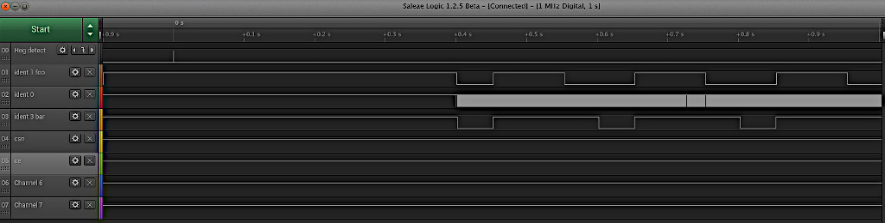

# 1. A uasyncio monitor

This library provides a means of examining the behaviour of a running
`uasyncio` system. The device under test is linked to a Raspberry Pi Pico. The
latter displays the behaviour of the host by pin changes and/or optional print
statements. A logic analyser or scope provides an insight into the way an
asynchronous application is working.

Communication with the Pico may be by UART or SPI, and is uni-directional from
system under test to Pico. If a UART is used only one GPIO pin is used; at last
a use for the ESP8266 transmit-only UART(1). SPI requires three - mosi, sck and
cs/.

Where an application runs multiple concurrent tasks it can be difficult to
locate a task which is hogging CPU time. Long blocking periods can also result
from several tasks each of which can block for a period. If, on occasion, these
are scheduled in succession, the times can add. The monitor issues a trigger
pulse when the blocking period exceeds a threshold. With a logic analyser the
system state at the time of the transient event may be examined.

The following image shows the `quick_test.py` code being monitored at the point
when a task hogs the CPU. The top line 00 shows the "hog detect" trigger. Line
02 shows the fast running `hog_detect` task which cannot run at the time of the
trigger because another task is hogging the CPU. Lines 01 and 03 show the `foo`
and `bar` tasks.  


### Breaking changes to support SPI

The `set_uart` method is replaced by `set_device`. Pin mappings on the Pico
have changed. Barring bug fixes or user suggestions I consider this project to
be complete.

## 1.1 Pre-requisites

The device being monitored must run firmware V1.17 or later. The `uasyncio`
version should be V3 (included in the firmware).

## 1.2 Usage

Example script `quick_test.py` provides a usage example. It may be adapted to
use a UART or SPI interface: see commented-out code.

### 1.2.1 Interface selection set_device()

An application to be monitored needs setup code to initialise the interface.
This comprises a call to `monitor.set_device` with an initialised UART or SPI
device. The Pico must be set up to match the interface chosen on the host: see
[section 4](./README.md#4-the-pico-code).

In the case of a UART an initialised UART with 1MHz baudrate is passed:
```python
from machine import UART
from monitor import monitor, monitor_init, hog_detect, set_device
set_device(UART(2, 1_000_000))  # Baudrate MUST be 1MHz.
```
In the case of SPI initialised SPI and cs/ Pin instances are passed:
```python
from machine import Pin, SPI
from monitor import monitor, monitor_init, hog_detect, set_device
set_device(SPI(2, baudrate=5_000_000), Pin('X6', Pin.OUT))  # Device under test SPI
```
The SPI instance must have default args; the one exception being baudrate which
may be any value. I have tested up to 30MHz but there is no benefit in running
above 1MHz. Hard or soft SPI may be used. It should be possible to share the
bus with other devices, although I haven't tested this.

### 1.2.2 Monitoring

On startup, after defining the interface, an application should issue:
```python
monitor_init()
```
Coroutines to be monitored are prefixed with the `@monitor` decorator:
```python
@monitor(2, 3)
async def my_coro():
    # code
```
The decorator args are as follows:
 1. A unique `ident` for the code being monitored. Determines the pin number on
 the Pico. See [Pico Pin mapping](./README.md#3-pico-pin-mapping).
 2. An optional arg defining the maximum number of concurrent instances of the
 task to be independently monitored (default 1).

Whenever the coroutine runs, a pin on the Pico will go high, and when the code
terminates it will go low. This enables the behaviour of the system to be
viewed on a logic analyser or via console output on the Pico. This behavior
works whether the code terminates normally, is cancelled or has a timeout.

In the example above, when `my_coro` starts, the pin defined by `ident==2`
(GPIO 5) will go high. When it ends, the pin will go low. If, while it is
running, a second instance of `my_coro` is launched, the next pin (GPIO 6) will
go high. Pins will go low when the relevant instance terminates, is cancelled,
or times out. If more instances are started than were specified to the
decorator, a warning will be printed on the host. All excess instances will be
associated with the final pin (`pins[ident + max_instances - 1]`) which will
only go low when all instances associated with that pin have terminated.

Consequently if `max_instances=1` and multiple instances are launched, a
warning will appear on the host; the pin will go high when the first instance
starts and will not go low until all have ended.

## 1.3 Detecting CPU hogging

A common cause of problems in asynchronous code is the case where a task blocks
for a period, hogging the CPU, stalling the scheduler and preventing other
tasks from running. Determining the task responsible can be difficult.

The pin state only indicates that the task is running. A pin state of 1 does
not imply CPU hogging. Thus
```python
@monitor(3)
async def long_time():
    await asyncio.sleep(30)
```
will cause the pin to go high for 30s, even though the task is consuming no
resources for that period.

To provide a clue about CPU hogging, a `hog_detect` coroutine is provided. This
has `ident=0` and, if used, is monitored on GPIO 3. It loops, yielding to the
scheduler. It will therefore be scheduled in round-robin fashion at speed. If
long gaps appear in the pulses on GPIO 3, other tasks are hogging the CPU.
Usage of this is optional. To use, issue
```python
import uasyncio as asyncio
from monitor import monitor, hog_detect
# code omitted
asyncio.create_task(hog_detect())
# code omitted
```
To aid in detecting the gaps in execution, the Pico code implements a timer.
This is retriggered by activity on `ident=0`. If it times out, a brief high
going pulse is produced on pin 28, along with the console message "Hog". The
pulse can be used to trigger a scope or logic analyser. The duration of the
timer may be adjusted - see [section 4](./README.md~4-the-pico-code).

Note that hog detection will be triggered if the host application terminates.
The Pico cannot determine the reason why the `hog_detect` task has stopped.

# 2. Monitoring synchronous code

In general there are easier ways to debug synchronous code. However in the
context of a monitored asynchronous application there may be a need to view the
timing of synchronous code. Functions and methods may be monitored either in
the declaration via a decorator or when called via a context manager.

## 2.1 The mon_func decorator

This works as per the asynchronous decorator, but without the `max_instances`
arg. This will activate the GPIO associated with ident 20 for the duration of
every call to `sync_func()`:
```python
@mon_func(20)
def sync_func():
    pass
```

## 2.2 The mon_call context manager

This may be used to monitor a function only when called from specific points in
the code.
```python
def another_sync_func():
    pass

with mon_call(22):
    another_sync_func()
```

It is advisable not to use the context manager with a function having the
`mon_func` decorator. The pin and report behaviour is confusing.

# 3. Pico Pin mapping

The Pico GPIO numbers used by idents start at 3 and have a gap where the Pico
uses GPIO's for particular purposes. This is the mapping between `ident` GPIO
no. and Pico PCB pin. Pins for the timer and the UART/SPI link are also
identified:

| ident   | GPIO | pin  |
|:-------:|:----:|:----:|
| nc/mosi |   0  |   1  |
| rxd/sck |   1  |   2  |
| nc/cs/  |   2  |   4  |
|   0     |   3  |   5  |
|   1     |   4  |   6  |
|   2     |   5  |   7  |
|   3     |   6  |   9  |
|   4     |   7  |  10  |
|   5     |   8  |  11  |
|   6     |   9  |  12  |
|   7     |  10  |  14  |
|   8     |  11  |  15  |
|   9     |  12  |  16  |
|  10     |  13  |  17  |
|  11     |  14  |  19  |
|  12     |  15  |  20  |
|  13     |  16  |  21  |
|  14     |  17  |  22  |
|  15     |  18  |  24  |
|  16     |  19  |  25  |
|  17     |  20  |  26  |
|  18     |  21  |  27  |
|  19     |  22  |  29  |
|  20     |  26  |  31  |
|  21     |  27  |  32  |
| timer   |  28  |  34  |

For a UART interface the host's UART `txd` pin should be connected to Pico GPIO
1 (pin 2).

For SPI the host's `mosi` goes to GPIO 0 (pin 1), and `sck` to GPIO 1 (pin 2).
The host's CS Pin is connected to GPIO 2 (pin 4).

There must be a link between `Gnd` pins on the host and Pico.

# 4. The Pico code

Monitoring via the UART with default behaviour is started as follows:
```python
from monitor_pico import run
run()
```
By default the Pico does not produce console output when tasks start and end.
The timer has a period of 100ms - pin 28 will pulse if ident 0 is inactive for
over 100ms. These behaviours can be modified by the following `run` args:
 1. `period=100` Define the hog_detect timer period in ms.
 2. `verbose=()` A list or tuple of `ident` values which should produce console
 output.
 3. `device="uart"` Set to "spi" for an SPI interface.
 4. `vb=True` By default the Pico issues console messages reporting on initial
 communication status, repeated each time the application under test restarts.
 Set `False` to disable these messages.

Thus to run such that idents 4 and 7 produce console output, with hogging
reported if blocking is for more than 60ms, issue
```python
from monitor_pico import run
run(60, (4, 7))
```

# 5. Performance and design notes

Using a UART the latency between a monitored coroutine starting to run and the
Pico pin going high is about 23μs. With SPI I measured -12μs. This isn't as
absurd as it sounds: a negative latency is the effect of the decorator which
sends the character before the coroutine starts. These values are small in the
context of `uasyncio`: scheduling delays are on the order of 150μs or greater
depending on the platform. See `quick_test.py` for a way to measure latency.

The use of decorators is intended to ease debugging: they are readily turned on
and off by commenting out.

The Pico was chosen for extremely low cost. It has plenty of GPIO pins and no
underlying OS to introduce timing uncertainties.

Symbols transmitted by the UART are printable ASCII characters to ease
debugging. A single byte protocol simplifies and speeds the Pico code.

The baudrate of 1Mbps was chosen to minimise latency (10μs per character is
fast in the context of uasyncio). It also ensures that tasks like `hog_detect`,
which can be scheduled at a high rate, can't overflow the UART buffer. The
1Mbps rate seems widely supported.

This project was inspired by
[this GitHub thread](https://github.com/micropython/micropython/issues/7456).
