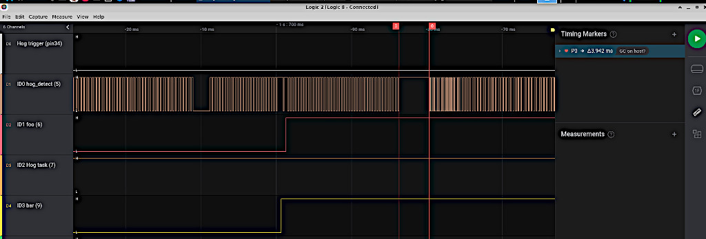
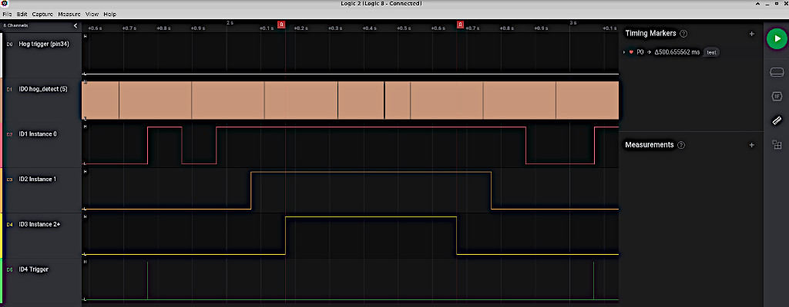
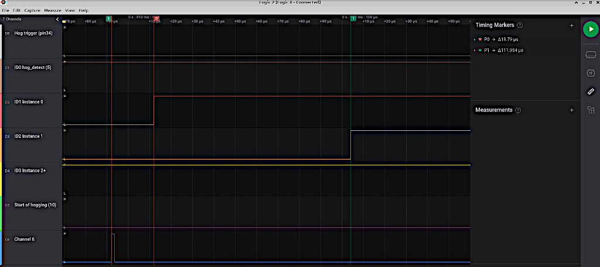
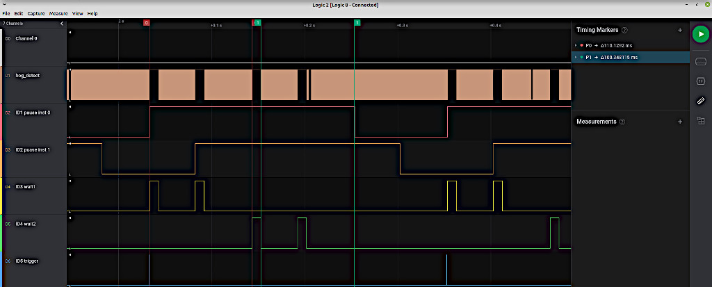
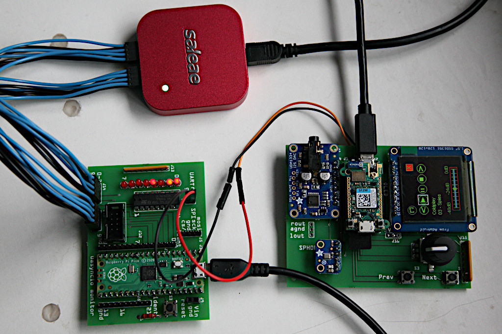

# 1. A uasyncio monitor

This library provides a means of examining the behaviour of a running
`uasyncio` system. The device under test is linked to a Raspberry Pico. The
latter displays the behaviour of the host by pin changes and/or optional print
statements. A logic analyser or scope provides an insight into the way an
asynchronous application is working; valuable informtion can also be gleaned at
the Pico command line.

Communication with the Pico may be by UART or SPI, and is uni-directional from
system under test to Pico. If a UART is used only one GPIO pin is used. SPI
requires three - `mosi`, `sck` and `cs/`.

Where an application runs multiple concurrent tasks it can be difficult to
identify a task which is hogging CPU time. Long blocking periods can also occur
when several tasks each block for a period. If, on occasion, these are
scheduled in succession, the times will add. The monitor issues a trigger pulse
when the blocking period exceeds a threshold. With a logic analyser the system
state at the time of the transient event may be examined.

The following image shows the `quick_test.py` code being monitored at the point
when a task hogs the CPU. The top line 00 shows the "hog detect" trigger. Line
01 shows the fast running `hog_detect` task which cannot run at the time of the
trigger because another task is hogging the CPU. Lines 02 and 04 show the `foo`
and `bar` tasks. Line 03 shows the `hog` task and line 05 is a trigger issued
by `hog()` when it starts monopolising the CPU. The Pico issues the "hog
detect" trigger 100ms after hogging starts.  


The following image shows brief (<4ms) hogging while `quick_test.py` ran. The
likely cause is garbage collection on the Pyboard D host. The monitor was able
to demostrate that this never exceeded 5ms.  



### Status

4th Oct 2021 Please regard this as "all new". Many functions have been renamed,
error checking has been improved and code made more efficient.

## 1.1 Pre-requisites

The device being monitored must run firmware V1.17 or later. The `uasyncio`
version should be V3 (included in the firmware). The file `monitor.py` should
be copied to the target, and `monitor_pico` to the Pico.

## 1.2 Quick start guide

For UART based monitoring, ensure that the host and Pico `gnd` pins are linked.
Connect the host's `txd` to the Pico pin 2 (UART(0) `rxd`). On the Pico issue:
```python
from monitor_pico import run
run()
```
Adapt the following to match the UART to be used on the host and run it.
```python
import uasyncio as asyncio
from machine import UART  # Using a UART for monitoring
import monitor
monitor.set_device(UART(2, 1_000_000))  # Baudrate MUST be 1MHz.

@monitor.asyn(1)  # Assign ident 1 to foo (GPIO 4)
async def foo():
    await asyncio.sleep_ms(100)

async def main():
    monitor.init()  # Initialise Pico state at the start of every run
    while True:
        await foo()  # Pico GPIO4 will go high for duration
        await asyncio.sleep_ms(100)

try:
    asyncio.run(main())
finally:
    asyncio.new_event_loop()
```
A square wave of period 200ms should be observed on Pico GPIO 4 (pin 6).

Example script `quick_test.py` provides a usage example. It may be adapted to
use a UART or SPI interface: see commented-out code.

### 1.2.1 Interface selection set_device()

An application to be monitored needs setup code to initialise the interface.
This comprises a call to `monitor.set_device` with an initialised UART or SPI
device. The Pico must be set up to match the interface chosen on the host: see
[section 4](./README.md#4-the-pico-code).

In the case of a UART an initialised UART with 1MHz baudrate is passed:
```python
from machine import UART
import monitor
monitor.set_device(UART(2, 1_000_000))  # Baudrate MUST be 1MHz.
```
In the case of SPI initialised SPI and cs/ Pin instances are passed:
```python
from machine import Pin, SPI
import monitor
monitor.set_device(SPI(2, baudrate=5_000_000), Pin('X6', Pin.OUT))  # Device under test SPI
```
The SPI instance must have default args; the one exception being baudrate which
may be any value. I have tested up to 30MHz but there is no benefit in running
above 1MHz. Hard or soft SPI may be used. It should be possible to share the
bus with other devices, although I haven't tested this.

### 1.2.2 Monitoring

On startup, after defining the interface, an application should issue:
```python
monitor.init()
```
Coroutines to be monitored are prefixed with the `@monitor.asyn` decorator:
```python
@monitor.asyn(2, 3)
async def my_coro():
    # code
```
The decorator positional args are as follows:
 1. `n` A unique `ident` in range `0 <= ident <= 21` for the code being
 monitored. Determines the pin number on  the Pico. See
 [Pico Pin mapping](./README.md#3-pico-pin-mapping).
 2. `max_instances=1` Defines the maximum number of concurrent instances of the
 task to be independently monitored (default 1).
 3. `verbose=True` If `False` suppress the warning which is printed on the host
 if the instance count exceeds `max_instances`.

Whenever the coroutine runs, a pin on the Pico will go high, and when the code
terminates it will go low. This enables the behaviour of the system to be
viewed on a logic analyser or via console output on the Pico. This behavior
works whether the code terminates normally, is cancelled or has a timeout.

In the example above, when `my_coro` starts, the pin defined by `ident==2`
(GPIO 5) will go high. When it ends, the pin will go low. If, while it is
running, a second instance of `my_coro` is launched, the next pin (GPIO 6) will
go high. Pins will go low when the relevant instance terminates, is cancelled,
or times out. If more instances are started than were specified to the
decorator, a warning will be printed on the host. All excess instances will be
associated with the final pin (`pins[ident + max_instances - 1]`) which will
only go low when all instances associated with that pin have terminated.

Consequently if `max_instances=1` and multiple instances are launched, a
warning will appear on the host; the pin will go high when the first instance
starts and will not go low until all have ended. The purpose of the warning is
because the existence of multiple instances may be unexpected behaviour in the
application under test.

## 1.3 Detecting CPU hogging

A common cause of problems in asynchronous code is the case where a task blocks
for a period, hogging the CPU, stalling the scheduler and preventing other
tasks from running. Determining the task responsible can be difficult.

The pin state only indicates that the task is running. A pin state of 1 does
not imply CPU hogging. Thus
```python
@monitor.asyn(3)
async def long_time():
    await asyncio.sleep(30)
```
will cause the pin to go high for 30s, even though the task is consuming no
resources for that period.

To provide a clue about CPU hogging, a `hog_detect` coroutine is provided. This
has `ident=0` and, if used, is monitored on GPIO 3. It loops, yielding to the
scheduler. It will therefore be scheduled in round-robin fashion at speed. If
long gaps appear in the pulses on GPIO 3, other tasks are hogging the CPU.
Usage of this is optional. To use, issue
```python
import uasyncio as asyncio
import monitor
# code omitted
asyncio.create_task(monitor.hog_detect())
# code omitted
```
To aid in detecting the gaps in execution, the Pico code implements a timer.
This is retriggered by activity on `ident=0`. If it times out, a brief high
going pulse is produced on GPIO 28, along with the console message "Hog". The
pulse can be used to trigger a scope or logic analyser. The duration of the
timer may be adjusted. Other modes of hog detection are also supported. See
[section 4](./README.md~4-the-pico-code).

## 1.4 Validation of idents

Re-using idents would lead to confusing behaviour. If an ident is out of range
or is assigned to more than one coroutine an error message is printed and
execution terminates. See [section 7](./README.md#7-validation) for a special
case where validation must be defeated.

# 2. Monitoring synchronous code

In the context of an asynchronous application there may be a need to view the
timing of synchronous code, or simply to create a trigger pulse at one or more
known points in the code. The following are provided:  
 * A `sync` decorator for synchronous functions or methods: like `async` it
 monitors every call to the function.
 * A `mon_call` context manager enables function monitoring to be restricted to
 specific calls.
 * A `trigger` function which issues a brief pulse on the Pico or can set and
 clear the pin on demand.

## 2.1 The sync decorator

This works as per the `@async` decorator, but with no `max_instances` arg. The
following example will activate GPIO 26 (associated with ident 20) for the
duration of every call to `sync_func()`:
```python
@monitor.sync(20)
def sync_func():
    pass
```

## 2.2 The mon_call context manager

This may be used to monitor a function only when called from specific points in
the code. Validation of idents is looser here because a context manager is
often used in a looping construct: it seems impractical to distinguish this
case from that where two context managers are instantiated with the same ID.

Usage:
```python
def another_sync_func():
    pass

with monitor.mon_call(22):
    another_sync_func()
```

It is advisable not to use the context manager with a function having the
`mon_func` decorator. The behaviour of pins and reports are confusing.

## 2.3 The trigger timing marker

The `trigger` closure is intended for timing blocks of code. A closure instance
is created by passing the ident. If the instance is run with no args a brief
(~80μs) pulse will occur on the Pico pin. If `True` is passed, the pin will go
high until `False` is passed.

The closure should be instantiated once only. If instantiated in a loop the
ident will fail the check on re-use.
```python
trig = monitor.trigger(10)  # Associate trig with ident 10.

def foo():
    trig()  # Pulse ident 10, GPIO 13

def bar():
    trig(True)  # set pin high
    # code omitted
    trig(False)  # set pin low
```

# 3. Pico Pin mapping

The Pico GPIO numbers used by idents start at 3 and have a gap where the Pico
uses GPIO's for particular purposes. This is the mapping between `ident` GPIO
no. and Pico PCB pin. Pins for the timer and the UART/SPI link are also
identified:

| ident   | GPIO | pin  |
|:-------:|:----:|:----:|
| nc/mosi |   0  |   1  |
| rxd/sck |   1  |   2  |
| nc/cs/  |   2  |   4  |
|   0     |   3  |   5  |
|   1     |   4  |   6  |
|   2     |   5  |   7  |
|   3     |   6  |   9  |
|   4     |   7  |  10  |
|   5     |   8  |  11  |
|   6     |   9  |  12  |
|   7     |  10  |  14  |
|   8     |  11  |  15  |
|   9     |  12  |  16  |
|  10     |  13  |  17  |
|  11     |  14  |  19  |
|  12     |  15  |  20  |
|  13     |  16  |  21  |
|  14     |  17  |  22  |
|  15     |  18  |  24  |
|  16     |  19  |  25  |
|  17     |  20  |  26  |
|  18     |  21  |  27  |
|  19     |  22  |  29  |
|  20     |  26  |  31  |
|  21     |  27  |  32  |
| timer   |  28  |  34  |

For a UART interface the host's UART `txd` pin should be connected to Pico GPIO
1 (pin 2).

For SPI the host's `mosi` goes to GPIO 0 (pin 1), and `sck` to GPIO 1 (pin 2).
The host's CS Pin is connected to GPIO 2 (pin 4).

There must be a link between `Gnd` pins on the host and Pico.

# 4. The Pico code

Monitoring via the UART with default behaviour is started as follows:
```python
from monitor_pico import run
run()
```
By default the Pico does not produce console output when tasks start and end.
The timer has a period of 100ms - pin 28 will pulse if ident 0 is inactive for
over 100ms. These behaviours can be modified by the following `run` args:
 1. `period=100` Define the hog_detect timer period in ms.
 2. `verbose=()` A list or tuple of `ident` values which should produce console
 output.
 3. `device="uart"` Set to `"spi"` for an SPI interface.
 4. `vb=True` By default the Pico issues console messages reporting on initial
 communication status, repeated each time the application under test restarts.
 Set `False` to disable these messages.

Thus to run such that idents 4 and 7 produce console output, with hogging
reported if blocking is for more than 60ms, issue
```python
from monitor_pico import run
run(60, (4, 7))
```
Hog reporting is as follows. If ident 0 is inactive for more than the specified
time, "Timeout" is issued. If ident 0 occurs after this, "Hog Nms" is issued
where N is the duration of the outage. If the outage is longer than the prior
maximum, "Max hog Nms" is also issued.

This means that if the application under test terminates, throws an exception
or crashes, "Timeout" will be issued.

## 4.1 Advanced hog detection

The detection of rare instances of high latency is a key requirement and other
modes are available. There are two aims: providing information to users lacking
test equipment and enhancing the ability to detect infrequent cases. Modes
affect the timing of the trigger pulse and the frequency of reports.

Modes are invoked by passing a 2-tuple as the `period` arg.  
 * `period[0]` The period (ms): outages shorter than this time will be ignored.
 * `period[1]` is the mode: constants `SOON`, `LATE` and `MAX` are exported.

The mode has the following effect on the trigger pulse:  
 * `SOON` Default behaviour: pulse occurs early at time `period[0]` ms after
 the last trigger.
 * `LATE` Pulse occurs when the outage ends.
 * `MAX` Pulse occurs when the outage ends and its duration exceeds the prior
 maximum.

The mode also affects reporting. The effect of mode is as follows:
 * `SOON` Default behaviour as described in section 4.
 * `LATE` As above, but no "Timeout" message: reporting occurs at the end of an
 outage only.
 * `MAX` Report at end of outage but only when prior maximum exceeded. This
 ensures worst-case is not missed.

Running the following produce instructive console output:
```python
from monitor_pico import run, MAX
run((1, MAX))
```

# 5. Test and demo scripts

`quick_test.py` Primarily tests deliberate CPU hogging. Discussed in section 1.

`full_test.py` Tests task timeout and cancellation, also the handling of
multiple task instances. If the Pico is run with `run((1, MAX))` it reveals
the maximum time the host hogs the CPU. On a Pyboard D I measured 5ms.
 
The sequence here is a trigger is issued on ident 4. The task on ident 1 is
started, but times out after 100ms. 100ms later, five instances of the task on
ident 1 are started, at 100ms intervals. They are then cancelled at 100ms
intervals. Because 3 idents are allocated for multiple instances, these show up
on idents 1, 2, and 3 with ident 3 representing 3 instances. Ident 3 therefore
only goes low when the last of these three instances is cancelled.



`latency.py` Measures latency between the start of a monitored task and the
Pico pin going high. In the image below the sequence starts when the host
pulses a pin (ident 6). The Pico pin monitoring the task then goes high (ident
1 after ~20μs). Then the trigger on ident 2 occurs 112μs after the pin pulse.



`syn_test.py` Demonstrates two instances of a bound method along with the ways
of monitoring synchronous code. The trigger on ident 5 marks the start of the
sequence. The `foo1.pause` method on ident 1 starts and runs `foo1.wait1` on
ident 3. 100ms after this ends, `foo.wait2` on ident 4 is triggered. 100ms
after this ends, `foo1.pause` on ident 1 ends. The second instance of `.pause`
(`foo2.pause`) on ident 2 repeats this sequence shifted by 50ms. The 10ms gaps
in `hog_detect` show the periods of deliberate CPU hogging.



# 6. Performance and design notes

Using a UART the latency between a monitored coroutine starting to run and the
Pico pin going high is about 23μs. With SPI I measured -12μs. This isn't as
absurd as it sounds: a negative latency is the effect of the decorator which
sends the character before the coroutine starts. These values are small in the
context of `uasyncio`: scheduling delays are on the order of 150μs or greater
depending on the platform. See `tests/latency.py` for a way to measure latency.

The use of decorators eases debugging: they are readily turned on and off by
commenting out.

The Pico was chosen for extremely low cost. It has plenty of GPIO pins and no
underlying OS to introduce timing uncertainties. The PIO enables a simple SPI
slave.

Symbols transmitted by the UART are printable ASCII characters to ease
debugging. A single byte protocol simplifies and speeds the Pico code.

The baudrate of 1Mbps was chosen to minimise latency (10μs per character is
fast in the context of uasyncio). It also ensures that tasks like `hog_detect`,
which can be scheduled at a high rate, can't overflow the UART buffer. The
1Mbps rate seems widely supported.

## 6.1 ESP8266 note

tl;dr ESP8266 applications can be monitored using the transmit-only UART 1.

I was expecting problems: on boot the ESP8266 transmits data on both UARTs at
75Kbaud. A bit at this baudrate corresponds to 13.3 bits at 1Mbaud. A receiving
UART will see a transmitted 1 as 13 consecutive 1 bits. Lacking a start bit, it
will ignore them. An incoming 0 will be interpreted as a framing error because
of the absence of a stop bit. In practice the Pico UART returns `b'\x00'` when
this occurs, which `monitor.py` ignores. When monitored the ESP8266 behaves
identically to other platforms and can be rebooted at will.

## 6.2 How it works

This is for anyone wanting to modify the code. Each ident is associated with
two bytes, `0x40 + ident` and `0x60 + ident`. These are upper and lower case
printable ASCII characters (aside from ident 0 which is `@` paired with the
backtick character). When an ident becomes active (e.g. at the start of a
coroutine), uppercase is transmitted, when it becomes inactive lowercase is
sent.

The Pico maintains a list `pins` indexed by `ident`. Each entry is a 3-list
comprising:
 * The `Pin` object associated with that ident.
 * An instance counter.
 * A `verbose` boolean defaulting `False`.

When a character arrives, the `ident` value is recovered. If it is uppercase
the pin goes high and the instance count is incremented. If it is lowercase the
instance count is decremented: if it becomes 0 the pin goes low.

The `init` function on the host sends `b"z"` to the Pico. This sets each pin
in `pins` low and clears its instance counter (the program under test may have
previously failed, leaving instance counters non-zero). The Pico also clears
variables used to measure hogging. In the case of SPI communication, before
sending the `b"z"`, a 0 character is sent with `cs/` high. The Pico implements
a basic SPI slave using the PIO. This may have been left in an invalid state by
a crashing host. The slave is designed to reset to a "ready" state if it
receives any character with `cs/` high.

The ident `@` (0x40) is assumed to be used by the `hog_detect()` function. When
the Pico receives it, processing occurs to aid in hog detection and creating a
trigger on GPIO28. Behaviour depends on the mode passed to the `run()` command.
In the following, `thresh` is the time passed to `run()` in `period[0]`.
 * `SOON` This retriggers a timer with period `thresh`. Timeout causes a
 trigger.
 * `LATE` Trigger occurs if the period since the last `@` exceeds `thresh`. The
 trigger happens when the next `@` is received.
 * `MAX` Trigger occurs if period exceeds `thresh` and also exceeds the prior
 maximum.

This project was inspired by
[this GitHub thread](https://github.com/micropython/micropython/issues/7456).

# 7. Validation

The `monitor` module attempts to protect against inadvertent multiple use of an
`ident`. There are use patterns which are incompatible with this, notably where
a decorated function or coroutine is instantiated in a looping construct. To
cater for such cases validation can be defeated. This is done by issuing:
```python
import monitor
monitor.validation(False)
```

# 8. A hardware implementation

The device under test is on the right, linked to the Pico board by means of a
UART.



I can supply a schematic and PCB details if anyone is interested.
