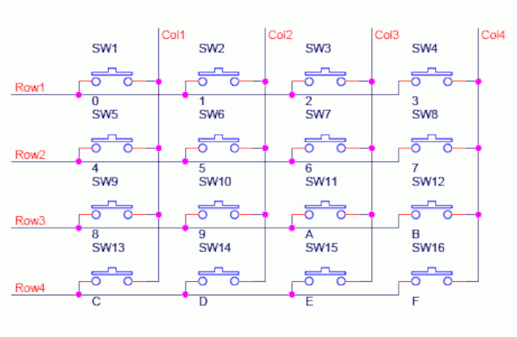

This document describes classes designed to enhance the capability of
MicroPython's `asyncio` when used in a microcontroller context.

# 0. Contents

 1. [Introduction](./DRIVERS.md#1-introduction)  
  1.1 [API Design](./DRIVERS.md#11-api-design) Callbacks vs. asynchronous interfaces.  
  1.2 [Switches](./DRIVERS.md#12-switches) Electrical considerations.  
 2. [Installation and usage](./DRIVERS.md#2-installation-and-usage)  
 3. [Interfacing switches](./DRIVERS.md#3-interfacing-switches)   
  3.1 [ESwitch class](./DRIVERS.md#31-eswitch-class) Switch debouncer with event interface.  
  3.2 [Switch class](./DRIVERS.md#32-switch-class) Switch debouncer with callbacks.  
 4. [Interfacing pushbuttons](./DRIVERS.md#4-interfacing-pushbuttons) Access short, long and double-click events.  
  4.1 [EButton class](./DRIVERS.md#41-ebutton-class) Debounced pushbutton with Event-based interface.  
  4.2 [Pushbutton class](./DRIVERS.md#42-pushbutton-class) Debounced pushbutton with callback interface.  
  &nbsp;&nbsp;&nbsp;&nbsp;&nbsp;4.2.1 [The suppress constructor argument](./DRIVERS.md#421-the-suppress-constructor-argument)  
  &nbsp;&nbsp;&nbsp;&nbsp;&nbsp;4.2.2 [The sense constructor argument](./DRIVERS.md#422-the-sense-constructor-argument)  
  4.3 [ESP32Touch class](./DRIVERS.md#43-esp32touch-class)  
  4.4 [Keyboard class](./DRIVERS.md#44-keyboard-class) Retrieve characters from a keypad.  
  4.5 [SwArray class](./DRIVERS.md#45-swarray-class) Interface a crosspoint array of switches or buttons.  
  4.6 [Suppress mode](./DRIVERS.md#46-suppress-mode) Reduce the number of events/callbacks.  
 5. [ADC monitoring](./DRIVERS.md#5-adc-monitoring) Pause until an ADC goes out of bounds  
  5.1 [AADC class](./DRIVERS.md#51-aadc-class)  
  5.2 [Design note](./DRIVERS.md#52-design-note)  
 6. [Quadrature encoders](./DRIVERS.md#6-quadrature-encoders) Asynchronous interface for rotary encoders.  
  6.1 [Encoder class](./DRIVERS.md#61-encoder-class)  
 7. [Ringbuf Queue](./DRIVERS.md#7-ringbuf-queue) A MicroPython optimised queue primitive.  
 8. [Delay_ms class](./DRIVERS.md#8-delay_ms-class) A flexible retriggerable delay with callback or Event interface.  
 9. [Additional functions](./DRIVERS.md#9-additional-functions)  
  9.1 [launch](./DRIVERS.md#91-launch) Run a coro or callback interchangeably.  
  9.2 [set_global_exception](./DRIVERS.md#92-set_global_exception) Simplify debugging with a global exception handler.  

###### [Tutorial](./TUTORIAL.md#contents)

# 1. Introduction

The classes presented here include asynchronous interfaces to switches,
pushbuttons, incremental encoders and ADC's. Specifically they are interfaces to
devices defined in the `machine` module rather than device drivers for external
hardware: as such they are grouped with synchronisation primitives. There are
also synchronisation primitives providing a microcontroller-optimised alternative
to the existing CPython-compatible primitives.

## 1.1 API design

The traditional interface to asynchronous external events is via a callback.
When the event occurs, the device driver runs a user-specified callback. Some
classes described here offer a callback interface. Where callbacks are used the
term `callable` implies a Python `callable`: namely a function, bound method,
coroutine or bound coroutine. Any of these may be supplied as a callback
function.


Newer class designs abandon callbacks in favour of asynchronous interfaces. This
is done by exposing `Event` or asynchronous iterator interfaces. It is arguable
that callbacks are outdated. Handling of arguments and return values is
inelegant and there are usually better ways using asynchronous coding. In
particular MicroPython's `asyncio` implements asynchronous interfaces in an
efficient manner. A task waiting on an `Event` consumes minimal resources. If a
user wishes to use a callback it may readily be achieved using patterns like the
following. In this case the device is an asynchronous iterator:
```python
   async def run_callback(device, callback, *args):
       async for result in device:
           callback(result, *args)
```
or, where the device presents an `Event` interface:
```python
async def run_callback(device, callback, *args):
    while True:
        await device.wait()  # Wait on the Event
        device.clear()  # Clear it down
        callback(*args)
```

## 1.2 Switches

From an electrical standpoint switches and pushbuttons are identical, however
from a programming perspective a switch is either open or closed, while a
pushbutton may be subject to single or double clicks, or to long presses.
Consequently switch drivers expose a simpler interface with a consequent saving
in code size.

All switch drivers rely on millisecond-level timing: callback functions must
be designed to terminate rapidly. This applies to all functions in the
application; coroutines should yield regularly. If these constraints are not
met, switch events can be missed.

All switches are prone to contact bounce, with a consequent risk of spurious
events: the drivers presented here embody debouncing. The phenomenon of contact
bounce is discussed in [this document](http://www.ganssle.com/debouncing.htm).

Two ways of wiring switches are supported. For small numbers of switches, the
switch may link a pin to `gnd` with the pin being configured as an input with a
pull up resistor. Interfacing such a switch is simple:
```Python
import asyncio
from machine import Pin
from primitives import ESwitch
es = ESwitch(Pin(16, Pin.IN, Pin.PULL_UP))

async def closure():
    while True:
        es.close.clear()  # Clear the Event
        await es.close.wait()  # Wait for contact closure
        print("Closed")  # Run code

asyncio.run(closure())
```

As the number of switches increases, consumption of GPIO pins can be
problematic. A solution is to wire the switches as a crosspoint array with the
driver polling each row in turn and reading the columns. This is the usual configuration of keypads.



Crosspoint connection requires precautions to
cater for the case where multiple contacts are closed simultaneously, as this
can have the effect of linking two output pins. Risk of damage is averted by
defining the outputs as open drain. This allows for one key rollover: if a
second key is pressed before the first is released, the keys will be read
correctly. Invalid contact closures may be registered if more than two contacts
are closed. This also applies where the matrix comprises switches rather than
buttons. In this case diode isolation is required:  


Whether or not diodes are used the column input pins must be pulled up. Scanning
of the array occurs rapidly, and built-in pull-up resistors have a high value.
If the capacitance between wires is high, spurious closures may be registered.
To prevent this it is wise to add physical resistors between the input pins and
3.3V. A value in the region of 1KΩ to 5KΩ is recommended.

# 2. Installation and usage

The latest release build of firmware or a newer preview build is recommended.
To install the library, connect the target hardware to WiFi and issue:
```python
import mip
mip.install("github:peterhinch/micropython-async/v3/primitives")
```
For any target including non-networked ones use
[mpremote](https://docs.micropython.org/en/latest/reference/mpremote.html):
```bash
$ mpremote mip install "github:peterhinch/micropython-async/v3/primitives"
```

Drivers are imported with:
```python
from primitives import Switch, Pushbutton, AADC
```
There is a test/demo program for the Switch and Pushbutton classes. On import
this lists available tests. It assumes a Pyboard with a switch or pushbutton
between X1 and Gnd. It is run as follows:
```python
from primitives.tests.switches import *
test_sw()  # For example
```
The test for the `AADC` class requires a Pyboard with pins X1 and X5 linked. It
is run as follows:
```python
from primitives.tests.adctest import test
test()
```

###### [Contents](./DRIVERS.md#0-contents)

# 3. Interfacing switches

The `primitives` module provides `ESwitch` and `Switch` classes. The former is a
minimal driver providing an `Event` interface. The latter supports callbacks and
`Event`s.

## 3.1 ESwitch class

```python
from primitives import ESwitch  # events.py
```
This provides a debounced interface to a switch connected to gnd or to 3V3. A
pullup or pull down resistor should be supplied to ensure a valid logic level
when the switch is open. The default constructor arg `lopen=1` is for a switch
connected between the pin and gnd, with a pullup to 3V3. Typically the pullup
is internal, the pin being as follows:
```python
from machine import Pin
pin_id = 0  # Depends on hardware
pin = Pin(pin_id, Pin.IN, Pin.PULL_UP)
```
Constructor arguments:

 1. `pin` The `Pin` instance: should be initialised as an input with a pullup or
 down as appropriate.
 2. `lopen=1` Electrical level when switch is open circuit i.e. 1 is 3.3V, 0 is
 gnd.

Methods:

 1. `__call__()` Call syntax e.g. `myswitch()` returns the logical debounced
 state of the switch i.e. 0 if open, 1 if closed.
 2. `deinit()` No args. Cancels the polling task and clears bound `Event`s.

Class variable:
 1. `debounce_ms=50` Debounce time in ms.

Bound objects:
 1. `close` An `Event` instance. Set on contact closure.
 2. `open` An `Event` instance. Set on contact open.

Application code is responsible for clearing the `Event` instances.  
Usage example:
```python
import asyncio
from machine import Pin
from primitives import ESwitch
es = ESwitch(Pin("Y1", Pin.IN, Pin.PULL_UP))

async def closure():
    while True:
        es.close.clear()
        await es.close.wait()
        print("Closed")

async def open():
    while True:
        es.open.clear()
        await es.open.wait()
        print("Open")

async def main():
    asyncio.create_task(open())
    await closure()  # Run forever

asyncio.run(main())
```

## 3.2 Switch class

```python
from primitives import Switch  # switch.py
```
This can run callbacks or schedule coros on contact closure and/or opening. As
an alternative to a callback based interface, bound `Event` objects may be
triggered on switch state changes.

This assumes a normally open switch connected between a pin and ground. The pin
should be initialised as an input with a pullup. A `callable` may be specified
to run on contact closure or opening; where the `callable` is a coroutine it
will be converted to a `Task` and will run asynchronously. Debouncing is
implicit: contact bounce will not cause spurious execution of the `callable`.

Constructor argument (mandatory):

 1. `pin` The initialised Pin instance.

Methods:

 1. `close_func(func, args=())` Args: `func` a `callable` to run on contact
 closure, `args` a tuple of arguments for the `callable`.
 2. `open_func(func, args=())` Args: `func` a `callable` to run on contact open,
 `args` a tuple of arguments for the `callable`.
 3. `__call__()` Call syntax e.g. `myswitch()` returns the physical debounced
 state of the switch i.e. 0 if grounded, 1 if connected to `3V3`.
 4. `deinit()` No args. Cancels the running task.

Class attribute:
 1. `debounce_ms=50` Debounce time in ms.

```python
from pyb import LED
from machine import Pin
import asyncio
from primitives import Switch

async def pulse(led, ms):
    led.on()
    await asyncio.sleep_ms(ms)
    led.off()

async def my_app():
    pin = Pin('X1', Pin.IN, Pin.PULL_UP)  # Hardware: switch to gnd
    red = LED(1)
    sw = Switch(pin)
    sw.close_func(pulse, (red, 1000))  # Note how coro and args are passed
    await asyncio.sleep(60)  # Dummy application code

asyncio.run(my_app())  # Run main application code
```

#### Event interface

This enables a task to wait on a switch state as represented by a bound `Event`
instance. A bound contact closure `Event` is created by passing `None` to
`.close_func`, in which case the `Event` is named `.close`. Likewise a `.open`
`Event` is created by passing `None` to `open_func`.

###### [Contents](./DRIVERS.md#0-contents)

# 4. Interfacing pushbuttons

The `primitives` module provides the following classes for interfacing
pushbuttons. The following support normally open or normally closed buttons
connected to gnd or to 3V3:
* `EButton` Provides an `Event` based interface.
* `Pushbutton` Offers `Event`s and/or callbacks.  
The following support normally open pushbuttons connected in a crosspoint array.
* `Keyboard` An asynchronous iterator responding to button presses.
* `SwArray` As above, but also supporting open, double and long events.
The latter can also support switches in a diode-isolated array.

## 4.1 EButton class

```python
from primitives import EButton  # events.py
```

This extends the functionality of `ESwitch` to provide additional events for
long and double presses.

This can support normally open or normally closed switches, connected to `gnd`
(with a pullup) or to `3V3` (with a pull-down). The `Pin` object should be
initialised appropriately. The default state of the switch can be passed in the
optional "sense" parameter on the constructor, otherwise the assumption is that
on instantiation the button is not pressed.

The EButton class uses logical rather than physical state: a button's state
is considered `True` if pressed, otherwise `False` regardless of its physical
implementation.

Constructor arguments:

 1. `pin` Mandatory. The initialised Pin instance.
 2. `suppress=False`. See [Suppress mode](./DRIVERS.md#46-suppress-mode).
 3. `sense=None`. Optionally define the electrical connection: see
 [section 4.2.1](./DRIVERS.md#411-the-sense-constructor-argument).

Methods:

 1. `__call__()` Call syntax e.g. `mybutton()` Returns the logical debounced
 state of the button (`True` corresponds to pressed).
 2. `rawstate()` Returns the logical instantaneous state of the button. There
 is probably no reason to use this.
 3. `deinit()` No args. Cancels the running task and clears all events.

Bound `Event`s:

 1. `press` Set on button press.
 2. `release` Set on button release.
 3. `long` Set if button press is longer than `EButton.long_press_ms`.
 4. `double` Set if two button preses occur within `EButton.double_click_ms`.

Application code is responsible for clearing any `Event`s that are used.

Class attributes:
 1. `debounce_ms=50` Debounce time in ms. Default 50.
 2. `long_press_ms=1000` Threshold time in ms for a long press.
 3. `double_click_ms=400` Threshold time in ms for a double-click.

### 4.1.1 The sense constructor argument

In most applications it can be assumed that, at power-up, pushbuttons are not
pressed. The default `None` value uses this assumption to read the pin state
and to assign the result to the `False` (not pressed) state at power up. This
works with normally open or normally closed buttons wired to either supply
rail; this without programmer intervention.

In certain use cases this assumption does not hold, and `sense` must explicitly
be specified. This defines the logical state of the un-pressed button. Hence
`sense=0` defines a button connected in such a way that when it is not pressed,
the voltage on the pin is gnd.

Whenever the pin value changes, the new value is compared with `sense` to
determine whether the button is closed or open.

###### [Contents](./DRIVERS.md#0-contents)

## 4.2 Pushbutton class

```py
from primitives import Pushbutton  # pushbutton.py
```

This can support normally open or normally closed switches, connected to `gnd`
(with a pullup) or to `3V3` (with a pull-down). The `Pin` object should be
initialised appropriately. The default state of the switch can be passed in the
optional "sense" parameter on the constructor, otherwise the assumption is that
on instantiation the button is not pressed.

The Pushbutton class uses logical rather than physical state: a button's state
is considered `True` if pressed, otherwise `False` regardless of its physical
implementation.

`callable` instances may be specified to run on button press, release, double
click or long press events; where the `callable` is a coroutine it will be
converted to a `Task` and will run asynchronously.

Please see the note on timing in [section 3](./DRIVERS.md#3-interfacing-switches).

Constructor arguments:

 1. `pin` Mandatory. The initialised Pin instance.
 2. `suppress` Default `False`. See
 [section 4.2.2](./DRIVERS.md#422-the-suppress-constructor-argument).
 3. `sense` Default `None`. Option to define electrical connection. See
 [section 4.2.1](./DRIVERS.md#421-the-sense-constructor-argument).

Methods:

 1. `press_func(func=False, args=())` Args: `func` a `callable` to run on button
 push, `args` a tuple of arguments for the `callable`.
 2. `release_func(func=False, args=())` Args: `func` a `callable` to run on
 button release, `args` a tuple of arguments for the `callable`.
 3. `long_func(func=False, args=())` Args: `func` a `callable` to run on long
 button push, `args` a tuple of arguments for the `callable`.
 4. `double_func(func=False, args=())` Args: `func` a `callable` to run on
 double button push, `args` a tuple of arguments for the `callable`.
 5. `__call__()` Call syntax e.g. `mybutton()` Returns the logical debounced
 state of the button (`True` corresponds to pressed).
 6. `rawstate()` Returns the logical instantaneous state of the button. There
 is probably no reason to use this.
 7. `deinit()` No args. Cancels the running debounce task.

Methods 1 - 4 may be called at any time. If `False` is passed for a callable,
any existing callback will be disabled. If `None` is passed, a bound `Event` is
created. See below for `Event` names.

Class attributes:
 1. `debounce_ms` Debounce time in ms. Default 50.
 2. `long_press_ms` Threshold time in ms for a long press. Default 1000.
 3. `double_click_ms` Threshold time in ms for a double-click. Default 400.

A simple Pyboard demo:
```python
from pyb import LED
from machine import Pin
import asyncio
from primitives import Pushbutton

def toggle(led):
    led.toggle()

async def my_app():
    pin = Pin('X1', Pin.IN, Pin.PULL_UP)  # Pushbutton to gnd
    red = LED(1)
    pb = Pushbutton(pin)
    pb.press_func(toggle, (red,))  # Note how function and args are passed
    await asyncio.sleep(60)  # Dummy

asyncio.run(my_app())  # Run main application code
```

### 4.2.1 The suppress constructor argument

See [Suppress mode](./DRIVERS.md#46-suppress-mode) for the purpose of this arg.
Note: `suppress` affects the behaviour of the `release_func` only. Other
callbacks including `press_func` behave normally. If the `suppress = True`
constructor argument is set, the `release_func` will be launched as follows:

 * If `double_func` does not exist on rapid button release.
 * If `double_func` exists, after the expiration of the double-click timer.
 * If `long_func` exists and the press duration causes `long_func` to be
 launched, `release_func` will not be launched.
 * If `double_func` exists and a double-click occurs, `release_func` will not
 be launched.

In the typical case where `long_func` and `double_func` are both defined, this
ensures that only one of `long_func`, `double_func` and `release_func` run. In
the case of a single short press, the `release_func` will be delayed until the
expiry of the double-click timer (because until that time a second click might
occur).

### 4.2.2 The sense constructor argument

In most applications it can be assumed that, at power-up, pushbuttons are not
pressed. The default `None` value uses this assumption to assign the `False`
(not pressed) state at power up. It therefore works with normally open or
normally closed buttons wired to either supply rail. This without programmer
intervention.

In certain use cases this assumption does not hold, and `sense` must explicitly
be specified. This defines the logical state at power-up regardless of whether,
at that time, the button is pressed. Hence `sense=0` defines a button connected
in such a way that when it is not pressed, the voltage on the pin is 0.

When the pin value changes, the new value is compared with `sense` to determine
if the button is closed or open. This is to allow the designer to specify if
the `closed` state of the button is active `high` or active `low`.

#### Event interface

Event names, where `None` is passed to a method listed below, are as follows:  
| method       | Event   |
|:-------------|:--------|
| press_func   | press   |
| release_func | release |
| long_func    | long    |
| double_func  | double  |

###### [Contents](./DRIVERS.md#0-contents)

## 4.3 ESP32Touch class

```py
from primitives import ESP32Touch  # pushbutton.py
```

This subclass of `Pushbutton` supports ESP32 touchpads providing a callback
based interface. See the
[official docs](http://docs.micropython.org/en/latest/esp32/quickref.html#capacitive-touch).

API and usage are as per `Pushbutton` with the following provisos:
 1. The `sense` constructor arg is not supported.
 2. The `Pin` instance passed to the constructor must support the touch
 interface. It is instantiated without args, as per the example below.
 3. There is an additional classmethod `threshold` which takes an integer arg.
 The arg represents the detection threshold as a percentage.

The driver determines the untouched state by periodically polling
`machine.TouchPad.read()` and storing its maximum value. If it reads a value
below `maximum * threshold / 100` a touch is deemed to have occurred. Default
threshold is currently 80% but this is subject to change.

Example usage:
```python
from machine import Pin
import asyncio
from primitives import ESP32Touch

ESP32Touch.threshold(70)  # optional

async def main():
    tb = ESP32Touch(Pin(15), suppress=True)
    tb.press_func(lambda : print("press"))
    tb.double_func(lambda : print("double"))
    tb.long_func(lambda : print("long"))
    tb.release_func(lambda : print("release"))
    while True:
        await asyncio.sleep(1)

asyncio.run(main())
```
If a touchpad is touched on initialisation no callbacks will occur even when
the pad is released. Initial button state is always `False`. Normal behaviour
will commence with subsequent touches.

The best threshold value depends on physical design. Directly touching a large
pad will result in a low value from `machine.TouchPad.read()`. A small pad
covered with an insulating film will yield a smaller change.

###### [Contents](./DRIVERS.md#0-contents)

## 4.4 Keyboard class

```python
from primitives import Keyboard  # sw_array.py
```
A `Keyboard` provides an interface to a set of pushbuttons arranged as a
crosspoint array. If a key is pressed its array index (scan code) is placed on a
queue. Keypresses are retrieved with `async for`. The driver operates by
polling each row, reading the response of each column. 1-key rollover is
supported - this is the case where a key is pressed before the prior key has
been released.

Constructor mandatory args:
 * `rowpins` A list or tuple of initialised open drain output pins.
 * `colpins` A list or tuple of initialised input pins (pulled up).

Constructor optional keyword only args:
 * `bufsize=10)` Size of keyboard buffer.
 * `db_delay=50` Debounce delay in ms.

 Methods:
 * `deinit(self)` Cancels the running task.
 * `__getitem__(self, scan_code)` Returns a `bool` being the instantaneous
 debounced state of a given pin. Enables code that causes actions after a button
 press, for example on release or auto-repeat while pressed.

The `Keyboard` class is subclassed from [Ringbuf Queue](./DRIVERS.md#7-ringbuf-queue)
enabling scan codes to be retrieved with an asynchronous iterator.
Example usage:
```python
import asyncio
from primitives import Keyboard
from machine import Pin
rowpins = [Pin(p, Pin.OPEN_DRAIN) for p in range(10, 14)]
colpins = [Pin(p, Pin.IN, Pin.PULL_UP) for p in range(16, 20)]

async def main():
    kp = Keyboard(rowpins, colpins)
    async for scan_code in kp:
        print(scan_code)
        if not scan_code:
            break  # Quit on key with code 0

asyncio.run(main())
```
In typical use the scan code would be used as the index into a string of
keyboard characters ordered to match the physical layout of the keys. If data
is not removed from the buffer, on overflow the oldest scan code is discarded.
There is no limit on the number of rows or columns however if more than 256 keys
are used, the `bufsize` arg would need to be adapted to handle scan codes > 255.
In this case an `array` or `list` object would be passed.

Usage example. Keypresses on a numeric keypad are sent to a UART with auto
repeat. Optionally link GPIO0 and GPIO1 to view the result.
```python
import asyncio
from primitives import Keyboard
from machine import Pin, UART
cmap = b"123456789*0#"  # Numeric keypad character map

async def repeat(kpad, scan_code, uart):  # Send at least one char
    ch = cmap[scan_code : scan_code + 1]  # Get character
    uart.write(ch)
    await asyncio.sleep_ms(400)  # Longer initial delay
    while kpad[scan_code]:  # While key is pressed
        uart.write(ch)
        await asyncio.sleep_ms(150)  # Faster repeat

async def receiver(uart):
    sreader = asyncio.StreamReader(uart)
    while True:
        res = await sreader.readexactly(1)
        print('Received', res)

async def main():  # Run forever
    rowpins = [Pin(p, Pin.OPEN_DRAIN) for p in range(10, 13)]
    colpins = [Pin(p, Pin.IN, Pin.PULL_UP) for p in range(16, 20)]
    uart = UART(0, 9600, tx=0, rx=1)
    asyncio.create_task(receiver(uart))
    kpad = Keyboard(rowpins, colpins)
    async for scan_code in kpad:
        rpt = asyncio.create_task(repeat(kpad, scan_code, uart))

asyncio.run(main())
```

###### [Contents](./DRIVERS.md#0-contents)

## 4.5 SwArray class

```python
from primitives.sw_array import SwArray, CLOSE, OPEN, LONG, DOUBLE, SUPPRESS
```
An `SwArray` is similar to a `Keyboard` except that single, double and long
presses are supported. Items in the array may be switches or pushbuttons,
however if switches are used they must be diode-isolated. For the reason see
[Switches](./DRIVERS.md#12-switches). It is an asynchronous iterator with events
being retrieved with `async for`: this returns a pair of integers being the scan
code and a bit representing the event which occurred.

Constructor mandatory args:
 * `rowpins` A list or tuple of initialised open drain output pins.
 * `colpins` A list or tuple of initialised input pins (pulled up).
 * `cfg` An integer defining conditions requiring a response. See Module
 Constants below.

Constructor optional keyword only args:
 * `bufsize=10` Size of buffer.

 Methods:
 * `deinit(self)` Cancels the running task.
 * `__getitem__(self, scan_code)` Returns a `bool` being the instantaneous
 debounced state of a given pin. Enables code that causes actions after a button
 press. For example after a press a pin might periodically be polled to achieve
 auto-repeat until released.

 Synchronous bound method:
 * `keymap()` Return an integer representing a bitmap of the debounced state of
 all switches in the array. 1 == closed.

 Class variables:
 * `debounce_ms = 50` Assumed maximum duration of contact bounce.
 * `long_press_ms = 1000` Threshold for long press detection.
 * `double_click_ms = 400` Threshold for double-click detection.

Module constants.  
The following constants are provided to simplify defining the `cfg` constructor
arg. This may be defined as a bitwise `or` of selected constants. For example if
the `CLOSE` bit is specified, switch closures will be reported. An omitted event
will be ignored. Where the array comprises switches it is usual to specify only
`CLOSE` and/or `OPEN`. This invokes a more efficient mode of operation because
timing is not required.
 * `CLOSE` Report contact closure.
 * `OPEN` Contact opening.
 * `LONG` Contact closure longer than `long_press_ms`.
 * `DOUBLE` Two closures in less than `double_click_ms`.
 * `SUPPRESS` Disambiguate. For explanation see
 [Suppress mode](./DRIVERS.md#46-suppress-mode). If all the above bits are set,
 a double click will result in `DOUBLE` and `OPEN` responses. If the `OPEN` bit
 were clear, only `DOUBLE` would occur.

The `SwArray` class is subclassed from [Ringbuf Queue](./DRIVERS.md#7-ringbuf-queue).
This is an asynchronous iterator, enabling scan codes and event types to be
retrieved as state changes occur. The event type is a single bit corresponding
to the above constants.

Usage example:
```python
import asyncio
from primitives.sw_array import SwArray, CLOSE, OPEN, LONG, DOUBLE, SUPPRESS
from machine import Pin
rowpins = [Pin(p, Pin.OPEN_DRAIN) for p in range(10, 14)]
colpins = [Pin(p, Pin.IN, Pin.PULL_UP) for p in range(16, 20)]
cfg = CLOSE | OPEN  #LONG | DOUBLE | SUPPRESS

async def main():
    swa = SwArray(rowpins, colpins, cfg)
    async for scan_code, evt in swa:
        print(scan_code, evt)
        if not scan_code:
            break  # Quit on key with code 0

asyncio.run(main())
```
###### [Contents](./DRIVERS.md#0-contents)

## 4.6 Suppress mode

The pushbutton drivers support a mode known as `suppress`. This option reduces
the number of events (or callbacks) that occur in the case of a double click.
Consider a button double-click. By default with `suppress=False` the following
events will occur in order:

 * `press`
 * `release`
 * `press`
 * `release`
 * `double`

Similarly a long press will trigger `press`, `long` and `release` in that
order. Some applications may require only one event to be triggered. Setting
`suppress=True` ensures this. Outcomes are as follows:

| Occurrence   | Events set      | Time of primary event        |
|:-------------|:----------------|:-----------------------------|
| Short press  | press, release  | After `.double_click_ms`     |
| Double press | double, release | When the second press occurs |
| Long press   | long, release   | After `long_press_ms`        |

The tradeoff is that the `press` and `release` events are delayed: the soonest
it is possible to detect the lack of a double click is `.double_click_ms`ms
after a short button press. Hence in the case of a short press when `suppress`
is `True`, `press` and `release` events are set on expiration of the double
click timer.

The following script may be used to demonstrate the effect of `suppress`. As
written, it assumes a Pi Pico with a push button attached between GPIO 18 and
Gnd, with the primitives installed.
```python
from machine import Pin
import asyncio
from primitives import Pushbutton

btn = Pin(18, Pin.IN, Pin.PULL_UP)  # Adapt for your hardware

async def main():
    pb = Pushbutton(btn, suppress=True)
    pb.release_func(print, ("SHORT",))
    pb.double_func(print, ("DOUBLE",))
    pb.long_func(print, ("LONG",))
    await asyncio.sleep(60)  # Run for one minute

asyncio.run(main())
```
###### [Contents](./DRIVERS.md#0-contents)

# 5. ADC monitoring

The `primitives.aadc` module provides the `AADC` (asynchronous ADC) class. This
provides for coroutines which pause until the value returned by an ADC goes
outside predefined bounds. Bounds may be absolute or relative to the current
value. Data from ADC's is usually noisy. Relative bounds provide a simple (if
crude) means of eliminating this. Absolute bounds can be used to raise an alarm
or log data, if the value goes out of range. Typical usage:
```python
import asyncio
from machine import ADC
import pyb
from primitives import AADC

aadc = AADC(ADC(pyb.Pin.board.X1))
async def foo():
    while True:
        value = await aadc(2000)  # Trigger if value changes by 2000
        print(value)

asyncio.run(foo())
```

## 5.1 AADC class

```py
from primitives import AADC  # aadc.py
```

`AADC` instances are awaitable. This is the principal mode of use.

Constructor argument:
 * `adc` An instance of `machine.ADC`.

Awaiting an instance:  
Function call syntax is used with zero, one or two unsigned integer args. These
determine the bounds for the ADC value.
 * No args: bounds are those set when the instance was last awaited.
 * One integer arg: relative bounds are used. The current ADC value +- the arg.
 * Two args `lower` and `upper`: absolute bounds.

Synchronous methods:
 * `read_u16` arg `last=False` Get the current data from the ADC. If `last` is
 `True` returns the last data read from the ADC. Returns a 16-bit unsigned int
 as per `machine.ADC.read_u16`.
 * `sense(normal)` By default a task awaiting an `AADC` instance will pause
 until the value returned by the ADC exceeds the specified bounds. Issuing
 `sense(False)` inverts this logic: a task will pause until the ADC value is
 within the specified bounds. Issuing `sense(True)` restores normal operation.

In the sample below the coroutine pauses until the ADC is in range, then pauses
until it goes out of range.

```python
import asyncio
from machine import ADC
from primitives import AADC

aadc = AADC(ADC('X1'))
async def foo():
    while True:
        aadc.sense(normal=False)
        value = await aadc(25_000, 39_000)  # Wait until in range
        print('In range:', value)
        aadc.sense(normal=True)
        value = await aadc()  # Wait until out of range
        print('Out of range:', value)

asyncio.run(foo())
```
## 5.2 Design note

The `AADC` class uses the `uasyncio` stream I/O mechanism. This is not the most
obvious design. It was chosen because the plan for `uasyncio` is that it will
include an option for prioritising I/O. I wanted this class to be able to use
this for applications requiring rapid response.

###### [Contents](./DRIVERS.md#0-contents)

# 6. Quadrature encoders

The [Encoder](https://github.com/peterhinch/micropython-async/blob/master/v3/primitives/encoder.py)
class is an asynchronous driver for control knobs based on quadrature encoder
switches such as [this Adafruit product](https://www.adafruit.com/product/377).
The driver is not intended for applications such as CNC machines. Drivers for NC
machines must never miss an edge. Contact bounce or vibration induced jitter can
cause transitions to occur at a high rate; these must be tracked which
challenges software based solutions.

Another issue affecting some solutions is that callbacks occur in an interrupt
context. This can lead to concurrency issues. These issues, along with general
discussion of MicroPython encoder drivers, are covered
[in this doc](https://github.com/peterhinch/micropython-samples/blob/master/encoders/ENCODERS.md).

This driver runs the user supplied callback in an `asyncio` context, so that
the callback runs only when other tasks have yielded to the scheduler. This
ensures that the callback runs with the same rules as apply to any `uasyncio`
task. This offers safety, even if the task triggers complex application
behaviour.

The `Encoder` can be instantiated in such a way that its effective resolution
can be reduced. A virtual encoder with lower resolution can be useful in some
applications. In particular it can track the "clicks" of a mechanical detent.

The driver allows limits to be assigned to the virtual encoder's value so that
a dial running from (say) 0 to 100 may be implemented. If limits are used,
encoder values no longer approximate absolute angles: the user might continue
to rotate the dial when its value is "stuck" at an endstop.

The callback only runs if a change in position of the virtual encoder has
occurred. In consequence of the callback running in an `asyncio` context, by
the time it is scheduled, the encoder's position may have changed by more than
one increment. The callback receives two args, the absolute value of the
virtual encoder at the time it was triggered and the signed change in this
value since the previous time the callback ran.

## 6.1 Encoder class

```python
from primitives import Encoder  # encoder.py
```

Existing users: the `delay` parameter is now a constructor arg rather than a
class varaiable.

Constructor arguments:  
 1. `pin_x` Initialised `machine.Pin` instances for the switch. Should be set
 as `Pin.IN` and have pullups.
 2. `pin_y` Ditto.
 3. `v=0` Initial value.
 4. `div=1` A value > 1 causes the motion rate of the encoder to be divided
 down, to produce a virtual encoder with lower resolution. This can enable
 tracking of mechanical detents - typical values are then 4 or 2 pulses per
 click.
 5. `vmin=None` By default the `value` of the encoder can vary without limit.
 Optionally maximum and/or minimum limits can be set.
 6. `vmax=None` As above. If `vmin` and/or `vmax` are specified, a `ValueError`
 will be thrown if the initial value `v` does not conform with the limits.
 7. `mod=None` An integer `N > 0` causes the divided value to be reduced modulo
 `N` - useful for controlling rotary devices.
 8. `callback=lambda a, b : None` Optional callback function. The callback
 receives two integer args, `v` being the virtual encoder's current value and
 `delta` being the signed difference between the current value and the previous
 one. Further args may be appended by the following.
 9. `args=()` An optional tuple of positional args for the callback.
 10. `delay=100` After motion is detected the driver waits for `delay` ms before
 reading the current position. A delay limits the rate at which the callback is
 invoked and improves debouncing. This is a minimal approach. See
 [this script](https://github.com/peterhinch/micropython-async/blob/master/v3/primitives/tests/encoder_stop.py)
 for a way to create a callback which runs only when the encoder stops moving.

 Synchronous method:  
 * `value` No args. Returns an integer being the virtual encoder's current
 value.

Not all combinations of arguments make mathematical sense. The order in which
operations are applied is:
 1. Apply division if specified.
 2. Restrict the divided value by any maximum or minimum.
 3. Reduce modulo N if specified.

An `Encoder` instance is an asynchronous iterator. This enables it to be used
as follows, with successive values being retrieved with `async for`:
```python
from machine import Pin
import asyncio
from primitives import Encoder

async def main():
    px = Pin(16, Pin.IN, Pin.PULL_UP)  # Change to match hardware
    py = Pin(17, Pin.IN, Pin.PULL_UP)
    enc = Encoder(px, py, div=4)  # div mtches mechanical detents
    async for value in enc:
        print(f"Value = {value}")

try:
    asyncio.run(main())
finally:
    asyncio.new_event_loop()
```
See [this doc](https://github.com/peterhinch/micropython-samples/blob/master/encoders/ENCODERS.md)
for further information on encoders and their limitations.

###### [Contents](./DRIVERS.md#0-contents)

# 7. Ringbuf Queue

```python
from primitives import RingbufQueue  # ringbuf_queue.py
```

The API of the `Queue` aims for CPython compatibility. This is at some cost to
efficiency. As the name suggests, the `RingbufQueue` class uses a pre-allocated
circular buffer which may be of any mutable type supporting the buffer protocol
e.g. `list`, `array` or `bytearray`.

It should be noted that `Queue`, `RingbufQueue` (and CPython's `Queue`) are not
thread safe. See [Threading](./THREADING.md).

Attributes of `RingbufQueue`:
 1. It is of fixed size, `Queue` can grow to arbitrary size.
 2. It uses pre-allocated buffers of various types (`Queue` uses a `list`).
 3. It is an asynchronous iterator allowing retrieval with `async for`.
 4. It has an "overwrite oldest data" synchronous write mode.

Constructor mandatory arg:
 * `buf` Buffer for the queue, e.g. list, bytearray or array. If an integer is
 passed, a list of this size is created. A  buffer of size `N` can hold a
 maximum of `N-1` items. Note that, where items on the queue are suitably
 limited, bytearrays or arrays are more efficient than lists.

Synchronous methods (immediate return):  
 * `qsize` No arg. Returns the number of items in the queue.
 * `empty` No arg. Returns `True` if the queue is empty.
 * `full` No arg. Returns `True` if the queue is full.
 * `get_nowait` No arg. Returns an object from the queue. Raises `IndexError`
 if the queue is empty.
 * `put_nowait` Arg: the object to put on the queue. Raises `IndexError` if the
 queue is full. If the calling code ignores the exception the oldest item in
 the queue will be overwritten. In some applications this can be of use.
 * `peek` No arg. Returns oldest entry without removing it from the queue. This
 is a superset of the CPython compatible methods.

Asynchronous methods:  
 * `put` Arg: the object to put on the queue. If the queue is full, it will
 block until space is available.
 * `get` Return an object from the queue. If empty, block until an item is
 available.

Retrieving items from the queue:

The `RingbufQueue` is an asynchronous iterator. Results are retrieved using
`async for`:
```python
async def handle_queued_data(q):
    async for obj in q:
        await asyncio.sleep(0)  # See below
        # Process obj
```
The `sleep` is necessary if you have multiple tasks waiting on the queue,
otherwise one task hogs all the data.

The following illustrates putting items onto a `RingbufQueue` where the queue is
not allowed to stall: where it becomes full, new items overwrite the oldest ones
in the queue:
```python
def add_item(q, data):
    try:
        q.put_nowait(data)
    except IndexError:
        pass
```
###### [Contents](./DRIVERS.md#0-contents)

# 8. Delay_ms class

This implements the software equivalent of a retriggerable monostable or a
watchdog timer. It has an internal boolean `running` state. When instantiated
the `Delay_ms` instance does nothing, with `running` `False` until triggered.
Then `running` becomes `True` and a timer is initiated. This can be prevented
from timing out by triggering it again (with a new timeout duration). So long
as it is triggered before the time specified in the preceding trigger it will
never time out.

If it does time out the `running` state will revert to `False`. This can be
interrogated by the object's `running()` method. In addition a `callable` can
be specified to the constructor. A `callable` can be a callback or a coroutine.
A callback will execute when a timeout occurs; where the `callable` is a
coroutine it will be converted to a `Task` and run asynchronously.

Constructor arguments (defaults in brackets):

 1. `func` The `callable` to call on timeout (default `None`).
 2. `args` A tuple of arguments for the `callable` (default `()`).
 3. `can_alloc` Unused arg, retained to avoid breaking code.
 4. `duration` Integer, default 1000 ms. The default timer period where no value
 is passed to the `trigger` method.

Synchronous methods:

 1. `trigger` optional argument `duration=0`. A timeout will occur after
 `duration` ms unless retriggered. If no arg is passed the period will be that
 of the `duration` passed to the constructor. The method can be called from a
 hard or soft ISR. It is now valid for `duration` to be less than the current
 time outstanding.
 2. `stop` No argument. Cancels the timeout, setting the `running` status
 `False`. The timer can be restarted by issuing `trigger` again. Also clears
 the `Event` described in `wait` below.
 3. `running` No argument. Returns the running status of the object.
 4. `__call__` Alias for running.
 5. `rvalue` No argument. If a timeout has occurred and a callback has run,
 returns the return value of the callback. If a coroutine was passed, returns
 the `Task` instance. This allows the `Task` to be cancelled or awaited.
 6. `callback` args `func=None`, `args=()`. Allows the callable and its args to
 be assigned, reassigned or disabled at run time.
 7. `deinit` No args. Cancels the running task. See [Object scope](./TUTORIAL.md#44-object-scope).
 8. `clear` No args. Clears the `Event` described in `wait` below.
 9. `set` No args. Sets the `Event` described in `wait` below.

Asynchronous method:
 1. `wait` One or more tasks may wait on a `Delay_ms` instance. Pause until the
 delay instance has timed out.

In this example a `Delay_ms` instance is created with the default duration of
1 sec. It is repeatedly triggered for 5 secs, preventing the callback from
running. One second after the triggering ceases, the callback runs.

```python
import asyncio
from primitives import Delay_ms

async def my_app():
    d = Delay_ms(callback, ('Callback running',))
    print('Holding off callback')
    for _ in range(10):  # Hold off for 5 secs
        await asyncio.sleep_ms(500)
        d.trigger()
    print('Callback will run in 1s')
    await asyncio.sleep(2)
    print('Done')

def callback(v):
    print(v)

try:
    asyncio.run(my_app())
finally:
    asyncio.new_event_loop()  # Clear retained state
```
This example illustrates multiple tasks waiting on a `Delay_ms`. No callback is
used.
```python
import asyncio
from primitives import Delay_ms

async def foo(n, d):
    await d.wait()
    d.clear()  # Task waiting on the Event must clear it
    print('Done in foo no.', n)

async def my_app():
    d = Delay_ms()
    tasks = [None] * 4  # For CPython compaibility must store a reference see Note
    for n in range(4):
        tasks[n] = asyncio.create_task(foo(n, d))
    d.trigger(3000)
    print('Waiting on d')
    await d.wait()
    print('Done in my_app.')
    await asyncio.sleep(1)
    print('Test complete.')

try:
    asyncio.run(my_app())
finally:
    _ = asyncio.new_event_loop()  # Clear retained state
```
###### [Contents](./DRIVERS.md#0-contents)

# 9. Additional functions

## 9.1 Launch

Import as follows:
```python
from primitives import launch
```
`launch` enables a function to accept a coro or a callback interchangeably. It
accepts the callable plus a tuple of args. If a callback is passed, `launch`
runs it and returns the callback's return value. If a coro is passed, it is
converted to a `task` and run asynchronously. The return value is the `task`
instance. A usage example is in `primitives/switch.py`.

## 9.2 set_global_exception

Import as follows:
```python
from primitives import set_global_exception
```
`set_global_exception` is a convenience funtion to enable a global exception
handler to simplify debugging. The function takes no args. It is called as
follows:

```python
import asyncio
from primitives import set_global_exception

async def main():
    set_global_exception()
    # Main body of application code omitted

try:
    asyncio.run(main())
finally:
    asyncio.new_event_loop()  # Clear retained state
```
This is explained in the tutorial. In essence if an exception occurs in a task,
the default behaviour is for the task to stop but for the rest of the code to
continue to run. This means that the failure can be missed and the sequence of
events can be hard to deduce. A global handler ensures that the entire
application stops allowing the traceback and other debug prints to be studied.

###### [Contents](./DRIVERS.md#0-contents)
